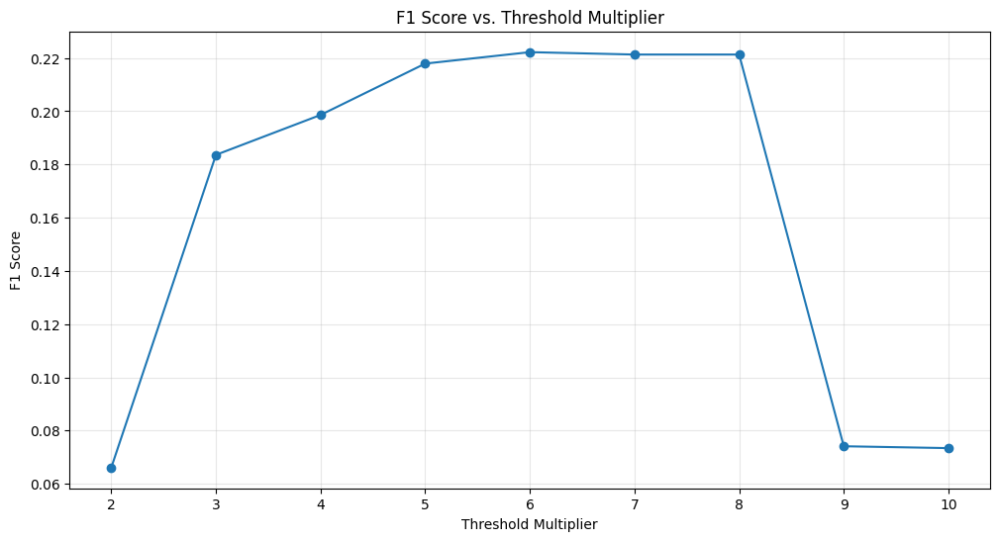

# Anomaly Detection Workshop 2 – Reflection Sheet

**Name(s):** Carmel Gafa  **Date:** 20.05.2025

Instructions
*Work individually or in pairs. Answer concisely (bullet points are fine). Save this file (or export to PDF) and email it to the instructor by **18:00 tomorrow**. Feel free to reference code, figures, or metrics from your notebook runs.*

---

## Notebook 01 – Dynamic (Time Series) Anomaly Detection

1. **Anomaly Type Identification**
**Describe one example from the notebook where a contextual anomaly was detected that would have been missed using a simple threshold method.**

Let us start by rephrasing the characteristics of contextual anomalies, that is a data point appears normal when considered alone (i.e. its value isn't extreme),but is anomalous when considered in the context of its temporal sequence or neighboring points.

The `generate_synthetic_data` function contained a specific section that generated a contextual anomaly, however a couple of issues were noted:

- The anomaly was meant to start between 0:00 and 6:00 (unusually high value at night), but it was specified to start at index 400, that is 16:00. The index was moved to 600, that is 0:00 so that it would start at an appropriate time of night.
- The anomaly offset the value by a value of 15, which was excessively large, even for the daytime and would have exceeded the threshold. It was was adjusted to a value of 6 so that the anomaly would be less extreme.

In order to facilitate the process, point and collective anomalies were temporary commented out to visualize the contextual anomaly only, obtaining the following figure:


The `calculate_metrics` function was modified slightly to include a confusion matrix. The function yielded the following results:

```text
confusion matrix:
[[995   0]
 [  5   0]]
Method: Moving Window
Accuracy:  0.9950
Precision: 0.0000
Recall:    0.0000
F1 Score:  0.0000
----------------------------------------
```

The moving window `sample_start` and `sample_end` were adjusted to be 580 and 620, respectively, so that the contextual anomaly would be detected by the moving window method, and ensure that the anomaly would have been missed by a simple threshold method. The following image confirmed this fact:


2. **Statistical vs Deep Learning**
**Between ARIMA and LSTM models, which performed better on your dataset and why? Reference specific metrics.**

When comparing ARIMA and LSTM models, the following results are obtained:

| **Metric**   | **ARIMA** | **LSTM**  |
|--------------|-----------|-----------|
| Accuracy     | 0.7750    | 0.9764    |
| Precision    | 0.0947    | 0.6923    |
| Recall       | 0.8214    | 0.3214    |
| F1 Score     | 0.1697    | 0.4390    |

- **Accuracy**, $\text{Accuracy} = \frac{\text{TP} + \text{TN}}{\text{Total samples}}$. Accuracy is not reliable in highly imbalanced datasets, which is the case in anomaly detection. A model hence obtain get very high accuracy  if it identifies all points as normal. It has therefore low relevance in anomaly detection.
- **Precision**, $\text{Precision} = \frac{\text{TP}}{\text{TP} + \text{FP}}$. Precision measures the proportion of correctly identified anomalies, hence focusing on false alarms. This is useful when the cost of false positives is high, for example if fraud detection as legitimate transactions can result in cards being blocked and a costly process of investigation. On the other hand, precision is not a good metric for systems where the cost of a false call is negligible when compared to the impact of missing the actual event, such as in earthquake detection. In these cases, it is better to raise false alarms if doing so increases the chances of detecting a real disaster.
- **Recall**, $\text{Recall} = \frac{\text{TP}}{\text{TP} + \text{FN}}$. Recall measures the proportion of actual anomalies that were correctly identified, thus focusing on missed calls. It is essential in scenarios where missing an anomaly carries a high cost. For example, in earthquake detection, a missed call could lead to loss of life. However, it can be misleading in systems where false positives are costly, such as fraud detection. Optimizing for high recall might mean flagging many legitimate transactions as fraudulent, leading to blocked cards and costly investigations.
- **F1 Score**, $\text{F1} = 2 \cdot \frac{\text{Precision} \cdot \text{Recall}}{\text{Precision} + \text{Recall}}$. F1 balances precision and recall, giving a single summary metric.It is particularly useful the desire to avoid too many false alarms (precision) and the desire not to miss too many anomalies (recall) are balanced.

So in our case:

- ARIMA was better at capturing all anomalies (recall  of 0.82 vs 0.32), but most were incorrect indicating overfitting.
-  LSTM reduced false positives (precision of 0.69 vs 0.09), making its detections more trustworthy.
- LSTM’s balance between precision and recall was far better (F1 of 0.4390 vs 0.1697).

3. **Vanishing Gradient Analysis**
**Explain in your own words how the vanishing gradient problem affects RNNs' ability to detect long-term anomaly patterns, and how LSTMs address this.**

The vanishing gradient problem is a fundamental issue in training RNNs, and it directly impacts their ability to detect long-term anomaly patterns in time series data.
The model computes gradients for each step when using backpropagation through time. These gradients are multiplied repeatedly as they are propagated backward across time steps. If the activation function (like tanh) has derivatives ≤ 1 (as it usually does), this repeated multiplication causes gradients to shrink exponentially. As a result, earlier layers receive gradients close to zero, meaning they learn little or nothing.

In anomaly detection, some patterns may depend on events many steps earlier (e.g., gradual drifts, periodic surges). RNNs with vanishing gradients, therefore, fail to capture these long-range dependencies, making them blind to contextual or collective anomalies that span longer intervals.

LSTMs solve this using:

- **Cell State**: A long-term memory component that flows through time largely unaffected by gradient shrinkage.
Gates:
    - **Forget Gate**: Decides what to discard.
    - **Input Gate**: Decides what to add.
    - **Output Gate**: Controls what to expose to the next layer.

This structure allows gradients to flow through many time steps without vanishing, maintaining a steady signal during training.

Additional references:
- [[https://www.youtube.com/watch?v=AsNTP8Kwu80]]
- [[https://www.youtube.com/watch?v=YCzL96nL7j0]]


4. **LSTM Gate Importance**
**Which of the three gates in an LSTM cell (forget, input, output) do you think is most critical for anomaly detection? Justify your answer.**

The forget gate is the most important component, as it determines which historical information to retain or eliminate from the cell state. In the context of anomaly detection, the model needs to maintain long-term trends to grasp what is deemed "normal" over time. If the forget gate fails to keep pertinent past information, the model risks losing essential temporal context, which may lead to overlooking subtle or delayed anomalies.

If not managed properly, the LSTM might discard important patterns too rapidly (resulting in lost information) or retain them for an extended period (causing overfitting).

The proper functioning of the forget gate is vital in preventing the model from overreacting to standard variations, which can create false positives. This phase aids in identifying issues based on actual differences from significant context that has been preserved.

5. **Autoencoder Threshold Selection**
**How did changing the reconstruction error threshold affect precision and recall in your LSTM Autoencoder results? What threshold would you recommend for a production system, and why?**

To understand how the reconstruction error threshold affects the precision and recall of the LSTM Autoencoder results, the threshold constant $\alpha$ was varied to modify the threshold, defined as:

$$
\text{Threshold} = \mu_{\text{val}} + \alpha \cdot \sigma_{\text{val}}
$$
We examined the F1 score, which balances precision and recall, for each value of \(\alpha\). The following graph illustrates the results obtained.



From this analysis, the following conclusions can be drawn:

**Low Multipliers (2–3):**  
In this range, the threshold for anomaly detection is low, leading to the identification of even minor deviations as potential anomalies. This heightened sensitivity increases recall, detecting many actual anomalies; however, it also results in a significant number of false positives. Consequently, while the system effectively identifies issues, precision suffers, leading to low F1 scores and indicating suboptimal detection efficiency.

**Moderate Multipliers (4–6):**  
As thresholds shift into the moderate range, anomaly detection becomes more balanced. This adjustment reduces noise and enhances the accurate identification of genuine anomalies. Both precision and recall significantly improve, creating an optimal scenario where numerous true anomalies are captured without excess false positives. The peak effectiveness is usually observed around a multiplier of 6, representing an ideal compromise between sensitivity and accuracy.

**High Multipliers (7–10):**  
In the high multiplier range, the detection threshold becomes overly strict, only triggering alerts for the most extreme errors. This leads to increased precision due to fewer false positives; however, recall sharply declines, causing many true anomalies to be overlooked. As a result, F1 scores tend to decrease, as the dominance of false negatives undermines the advantages of enhanced precision. Although the system may appear more accurate, it risks missing critical anomalies that require attention.

Based on the analysis, the threshold constant at $\alpha = 6$ for a production system is recommended.
This value yields the highest F1 score, indicating an optimal balance between precision and recall, that is it allows the system to detect the majority of meaningful anomalies while minimizing false positives.


6. **Comparative Analysis**
**For your dataset, rank the three methods (Moving Window, ARIMA, LSTM Autoencoder) by F1-score. Identify one domain where the lowest-performing method might actually be preferable.**

| Rank | Method            | F1 Score |
|------|-------------------|----------|
| 1    | LSTM              | 0.4390   |
| 2    | Feedforward NN    | 0.4000   |
| 3    | LSTM Autoencoder  | 0.1836   |

Autoencoders are a category of neural networks designed to replicate their input. When an autoencoder is trained with typical data, it becomes adept at reproducing standard patterns. When presented with outlier data, the reconstruction error rises, yielding a natural score for anomalies.

LSTM Autoencoders merge the sequence processing strengths of LSTMs with the unsupervised learning of autoencoders, making them suited for detecting anomalies in time series data.

In healthcare settings, particularly in intensive care units, patient vital signs are constantly monitored through sensors that monitor metrics such as pulse rate, blood pressure levels, and the oxygen saturation in the blood (SpO₂).

The collected data is time-series based, and potential anomalies include irregular heartbeats, sudden decreases in oxygen levels, and fluctuations in blood pressure.

LSTM Autoencoders may be effective for medical monitoring due to several factors. 

First, they utilize unsupervised learning, enabling them to identify anomalies in real-time data streams without prior labeling, which is essential since anomalies often go unrecorded. 

Additionally, these models excel at capturing temporal patterns, allowing them to analyze how vital signs fluctuate over time and detect irregularities across multiple time steps. This capability is crucial, as the presentation of anomalies can differ from patient to patient. 

Furthermore, LSTM Autoencoders have the ability to generalize to novel events, recognizing deviations even when they haven't encountered a specific scenario before. 

---

## Notebook 02 – Graph-Based Anomaly Detection

7. **Graph Structure Intuition**
**Describe a real-world scenario where modeling data as a graph would reveal anomalies that traditional tabular methods would miss.**

A key application of detecting financial transaction fraud involves showing each transaction in a clear table format. This format usually includes columns like transaction ID, sender, receiver, amount, and timestamp. While standard methods can identify unusual transaction amounts, they often do not capture how accounts are related, which is vital for spotting coordinated fraud.

To improve fraud detection, we can represent this system as a graph, where:

- **Nodes** stand for individual accounts.
- **Edges** represent transactions, with weights based on transaction amounts or frequency.

Using this graph model helps us find relational issues, such as:

- Clusters of transactions that look suspicious, which might suggest fraud rings (organized groups that collaborate to carry out systematic, large-scale fraud).
- Unusual connections or importance of accounts that have been inactive.
- Sudden increases in interactions among accounts that are typically considered legitimate.

This approach can make fraud detection strategies more effective and help protect financial transactions.


In the example above, Nodes A, B, C, and D form a tightly connected cluster with multiple bidirectional transactions. This is structurally anomalous, that is the pattern of connections deviate from the expected.
Nodes E and F have a single large transaction that is potentially anomalous in amount but not structure.
Such a dense, cyclical pattern among A–D could be flagged by graph-based anomaly detectors, but missed in a row-by-row tabular analysis.


8. **Centrality Measure Effectiveness**
**Which graph centrality measure (degree, betweenness, clustering coefficient) was most effective at detecting the injected anomalies in your financial transaction network? Explain why.**

The analysis of the transaction network indicates that betweenness centrality is the most effective measure for detecting anomalies. In particular, Node 5 stands out as the most significant node due to its high degree, or many direct connections, and its particularly high betweenness centrality. This suggests that Node 5 is located on a large number of the shortest paths connecting other nodes, positioning it as a critical bridge within the network.

Node 5 can serve as a likely candidate for roles in money mule scenarios; it connects multiple fraud clusters; and as an intermediary in money laundering pathways. Data from node-level metrics shows that Node 5 is significant. It has about 10 connections and a high betweenness centrality. For comparison, Node 4 has a betweenness centrality of 0.1359 and Node 0 has 0.1287, suggesting that Node 5 is even more important.
Graphically, Node 5's prominence is evident: its size and color reflect its high degree and betweenness.

Degree centrality may successfully identify well-connected hubs; however, these hubs are frequently found in scale-free networks and may not always indicate anomalous behavior. Betweenness centrality identifies strategically important nodes, such as bridge nodes facilitating laundering or control points within fraud networks. 

9. **Node2Vec Parameter Tuning**
**How did adjusting the Node2Vec parameters p and q affect the embedding space? Which configuration best separated normal and anomalous nodes?**

Node2Vec is a graph embedding algorithm that learns vector representations of nodes by simulating second-order biased random walks (decision depends on current node and previous node), enabling it to capture both local and global graph structure. The parameters $p$ and $q$ control the walk’s behavior

- $p$ influences the likelihood of revisiting a node (return)
- $q$ balances exploration between local proximity and structural similarity.

| Setting              | Effect on Walks       | Embedding Captures               |
| -------------------- | --------------------- | -------------------------------- |
| $p = 1$, $q = 1$     | Unbiased random walks | Similar to DeepWalk              |
| $p \gg 1$, $q \ll 1$ | DFS-like walks        | Structural roles (e.g., bridges) |
| $p \ll 1$, $q \gg 1$ | BFS-like walks        | Local proximity (communities)    |


| **Configuration** | **Walk Behavior**                    | **F1** |
| ----------------- | ------------------------------------ | ------ |
| $p = 1$,$ q = 1$  | Unbiased (like DeepWalk)             | 0.7273 |
| $p=2$, $q=0.5$    | Discourages backtracking, DFS-biased | 0.7619 |
| $p=0.5$, $q=2$    | Encourages return, BFS-biased        | 0.7273 |

The configuration $p=2$, $q=0.5$ produced the highest F1 score of 0.7619, indicating it was the most effective at separating normal and anomalous nodes in the embedding space.

10. **Community Detection Insight**
**When using community-based anomaly detection, what pattern of false positives or false negatives did you observe? What does this suggest about the structure of the anomalies?**

The following results were obtained in this test:

```
Detected 9 communities

Community-Based Method Results:
True anomalies: 10
Detected anomalies: 39

Performance:
Precision: 0.0000
Recall: 0.0000
F1 Score: 0.0000
```
The community-based method detected no true anomalies and over-flagged boundary nodes as anomalous. This reveals that the injected anomalies were structurally cohesive and internally consistent, causing them to blend into a distinct community and evade detection. Conversely, false positives arose from nodes on the edge of communities, which had low local consistency. The results suggest that this detection strategy is not well-suited for identifying isolated, structured anomaly clusters.

The community-based method detected no true anomalies and over-flagged boundary nodes as anomalous, revealing that the injected anomalies were structurally cohesive and internally consistent, causing them to blend into a distinct community and evade detection. On the other hand, false positives emerged from nodes at the edges of communities that exhibited low local consistency.The results suggest that this detection strategy is unsuited for identifying isolated, structured anomaly clusters.

11. **GNN Architecture Decision**
**If you were to adapt the GCN autoencoder model to detect account takeovers in your transaction network, what specific modifications to the architecture would you make and why?**

An account takeover occurs when an attacker gains control of a legitimate user’s account and begins initiating unauthorized activity. In the context of a transaction network, this behaviour has distinct temporal and structural signatures that differentiate it from regular account activity. Considering the GCN equation

$$H^{(l+1)} = \sigma(\tilde{D}^{-\frac{1}{2}}\tilde{A}\tilde{D}^{-\frac{1}{2}}H^{(l)}W^{(l)})$$

The encoder part of a GCN autoencoder uses this update rule to produce a final representation $Z = H^{(L)}$.
The decoder then attempts to reconstruct either:
The adjacency matrix $\hat{A} \approx A$, or
The node features $\hat{X} \approx X$,
 using $Z$ — the learned node embeddings.

The following characteristics are indicative of a takeover,

**Behavioural anomalies** are analyzed when examining how $H^{(l)}$ evolves between time $t$ and $t+1$, even if $\tilde{A}$ remains mostly unchanged.

- Sudden spike in transaction frequency or amount, especially after a period of inactivity.
- Transactions at unusual times (e.g., 3 AM activity for an account usually active at noon).
- Sends funds to new or unusual accounts not previously associated with the account.
- Usage of unfamiliar payment methods or new device/browser metadata if available.

**Structural anomalies** emerge from unusual message-passing via $\tilde{A}$.

- Connects to nodes it has never interacted with before.
- The rapid increase in connectivity (e.g., from a sparse to a hub node).
- Sudden rise in betweenness or degree; the account starts linking subgroups.
- The pattern occurs over a short time window, not gradually.

To detect account takeovers, the GCN autoencoder must be extended to capture both temporal drift in node behaviour and structural deviations in local connectivity.

- Temporal Modeling Extension. Incorporate time dynamics by applying the GCN autoencoder across graph snapshots over time or by embedding it in a temporal framework such as Temporal GCNs (T-GCN).
- Behavioral Feature Augmentation. Enrich the node feature matrix $H^{(0)} = X$ with behavioral attributes, including:

    - Rolling average transaction value
    - Count of unique recipients over past windows
    - Time-of-day activity profile
    - Device/browser ID fingerprints (if available)


Additional References:
- [[https://www.youtube.com/watch?v=CwHNUX2GWvE]]


12. **Comparative Analysis**
Between statistical methods and graph neural networks, which approach showed better performance on structural anomalies versus attribute-based anomalies? Support your answer with metrics from your runs.

The following results were obtained int  this study:

| **Method**           | **Detected Anomalies** | **Precision** | **Recall** | **F1 Score** |
|----------------------|------------------------|---------------|------------|--------------|
| Statistical          | 4                      | 1.0000    | 0.4000     | 0.5714       |
| GCN Autoencoder      | 13                     | 0.6154        | 0.8000     | 0.6957       |
| Node2Vec (p=2, q=0.5)| 11                     | 0.7273        | 0.8000 | **0.7619**   |

1. Statistical methods are high in precision but often overlook many anomalies. They work best when obvious issues stand out in data, like unusual connections or groupings. However, they usually miss more subtle problems or those based on relationships within the graph.
2. The GCN Autoencoder is good at finding structural problems by using the adjacency matrix to create useful embeddings. It effectively identifies unusual patterns but may lead to more false positives because it is generally sensitive.
3. Node2Vec (p=2, q=0.5) achieved the highest F1 score, showing good performance. It can understand both local neighbourhood patterns and roles in the structure by using biased random walks. This ability helps it identify many anomalies, making it effective for structural and attribute-based differences.

---

### Final reflection

13. **Cross-Domain Transfer**
Identify one technique from time series anomaly detection that could be adapted to improve graph-based approaches, or vice versa. Explain how this transfer would work.

In time series anomaly detection, sequence autoencoders, like LSTM autoencoders are used to rebuild recent data sequences. We flag points or small sequences with a high reconstruction error as anomalies. This works because the model has learned to recreate only normal patterns.

One idea is to improve Graph Convolutional Network (GCN) autoencoders for graph data by adding this method to detect changes over time, similar to time series analysis.

Key steps will include:

1. **Add Temporal Reconstruction Loss**: Create snapshots of the graph over time to capture its changes. Each snapshot represents the graph at a specific moment.
2. **Use Temporal GCN Autoencoders or Recurrent GCNs**: Turn each snapshot into embeddings with these models. This will compress important information while maintaining the relationships among nodes and helping to find changing patterns.
3. **Assess Changes in Embeddings**: Check how the embeddings and node features differ across snapshots. This helps identify significant behavioral changes.
4. **Identify Anomalous Nodes**: Find nodes with large changes in their embeddings and flag them as unusual, similar to practices in time series analysis. This allows for early detection of potential issues.

In summary, by using time-based analysis in GCN autoencoders, we can enhance change detection in dynamic graphs, leading to better identification of unusual behaviors.

14. **Practical Deployment**
If you were to deploy one of these models in a production environment, what three key monitoring metrics would you track over time to ensure continued detection quality?


Monitoring a combination of performance stability, model behaviour, and data drift is desirable to ensure continued detection quality when deploying an anomaly detection model (e.g., GCN Autoencoder, Node2Vec + downstream classifier, or statistical method) in a production environment. Some metrics include:

- Precision-Recall Drift looks at how well a model identifies unusual behaviour over time. Key metrics for this are the F1 Score and trends in Precision and Recall. Monitoring these is important because a drop in precision may mean more false positives, while a decrease in recall can lead to missing actual anomalies. The F1 score gives a complete picture of how the model is performing. If labels, like confirmed fraud cases, are available, it is possible to calculate these metrics using a rolling window. 
- Embedding drift and reconstruction error distribution is about keeping track of node representations or the reconstruction loss over time. Monitoring these aspects is important because sudden changes in the average reconstruction error or the distribution of node embeddings can indicate problems, like changes in data distribution or a decline in model performance. It is helpful to monitor key statistics such as the mean and standard deviation of reconstruction errors or embedding norms to keep an eye on these changes. Visualizing these changes with dimensionality reduction tools like PCA snapshots over time can offer valuable insights into how the model's performance is changing.

15. **Key Takeaway**
What was the most surprising or valuable insight you gained from implementing these anomaly detection techniques? (≤3 sentences)


<div style="text-align: center">⁂</div>

[^1]: Reflection_Sheet_AD_Workshop-2.md

